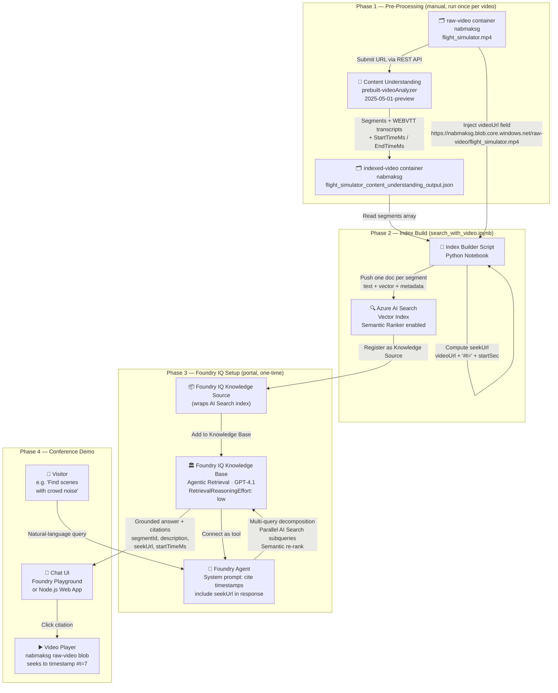

# Option C: Video Content Q&A and Search — Architecture

## Overview

A pre-built, walk-up conference demo where visitors type natural-language questions (e.g., "Find scenes with crowd noise") and receive timestamped video results they can immediately play. Built on Azure Blob Storage, Content Understanding, Azure AI Search, and Foundry IQ.

---

## Tech Stack

| Layer | Service | Role |
|---|---|---|
| Video Storage | Azure Blob Storage (`nabmaksg` / `raw-video`) | Hosts source `.mp4` files; public blob access enables browser `#t=` seeking |
| CU Output Storage | Azure Blob Storage (`nabmaksg` / `indexed-video`) | Holds pre-processed CU JSON output per video |
| Video Intelligence | Azure Content Understanding `prebuilt-videoAnalyzer` (`2025-05-01-preview`) | Generates segments, transcripts, descriptions, and millisecond timestamps |
| Index Builder | Python Notebook (`search_with_video.ipynb`) | Reads CU JSON, **injects `videoUrl` + `seekUrl`**, pushes documents to AI Search |
| Search & Retrieval | Azure AI Search (vector index, semantic ranker) | Stores indexed video segments; serves hybrid / vector queries |
| Knowledge Layer | Foundry IQ Knowledge Base (Preview) | Wraps AI Search index; provides multi-query agentic retrieval for agents |
| Agent | Foundry Agent Service (GPT-4.1) | Receives visitor questions, calls Foundry IQ, returns grounded timestamp citations |
| Demo UI | Foundry Agent Playground **or** Node.js Video Search App | Chat interface; renders citations as clickable video links that seek to timestamp |

---

## Service Selection: Content Understanding vs Video Indexer

Both services were tested against the same video (`flight_simulator.mp4`). The table below reflects what each service **actually produced** in its output JSON.

| Signal | Content Understanding (`prebuilt-videoAnalyzer`) | Azure Video Indexer (Default preset) | Relevance to Option C |
|---|---|---|---|
| **Segment descriptions** | ✅ 5 natural-language descriptions, time-windowed | ❌ None | **Critical** — RAG grounding text |
| **Transcript** | ✅ Per-phrase with `startTimeMs`/`endTimeMs` + speaker | ✅ Per-sentence with confidence + speakerId | High |
| **Brand / logo detection** | ❌ Not in prebuilt output | ✅ "Airbus" (confidence 1.0, Wikipedia ref) | High — broadcast use case |
| **OCR (on-screen text)** | ❌ Not in prebuilt output | ✅ "AIRBUS" with pixel bounding box | Medium |
| **Named locations** | ❌ None | ✅ "Orlando Ground" from transcript | Medium |
| **Visual labels** | ❌ None | ✅ 23 labels (aircraft, sky, aviation, jet engine…) | High — enables label-based search |
| **Topics** | ❌ None | ✅ NLP, AI, Machine Learning, Science, Technology | Medium |
| **Audio effects** | ❌ None | ✅ Crowd, siren, laughter etc. (requires Advanced Audio preset) | **Critical** — "Find crowd noise" demo query |
| **Face detection** | ❌ Not in prebuilt (limited access) | ✅ 3 faces, thumbnails, timestamps | Medium |
| **Object detection** | ❌ None | ✅ Airplane (×2), PottedPlant with WikiData IDs | Medium |
| **Content moderation** | ❌ None | ✅ Textual moderation, sentiment, emotion | Low for demo |
| **Output format** | ✅ Markdown + structured JSON — RAG-ready | ❌ Flat arrays by insight type, not by time chunk | **Critical** |
| **AI Search ingestion** | ✅ One doc per segment, no post-processing | ❌ Requires custom parser to merge 10+ insight arrays by timestamp | **Critical** |
| **Agent connector** | ✅ Direct Python path, no connectors | ❌ Blocked by org policy (Power Automate, Logic Apps) | **Critical** |
| **3-week delivery risk** | ✅ Low — pipeline works today | ❌ High — custom ETL needed before anything is searchable | **Critical** |

### Why CU was chosen

Content Understanding is **not the richer service** — Video Indexer produces significantly more signals. The decision is entirely about **pipeline unblocking**:

- VI requires a custom time-slice merge across 10+ insight arrays before anything is searchable
- VI's automation connectors (Power Automate, Logic Apps) are blocked by organisational policy
- CU's segment structure maps directly to AI Search documents with zero post-processing

### Planned enhancement: hybrid merge

Both outputs exist. A ~50-line merge script can enrich each CU segment with VI's overlapping labels, brands, and audio effects, then push one unified document per segment to AI Search. This gives CU's RAG structure **plus** VI's richer signals. Planned as a post-MVP enhancement once the baseline pipeline is validated.

```
CU output   →  segment windows [startMs → endMs] with descriptions
VI output   →  labels / brands / audio effects per timestamp
Merge       →  for each CU segment, pull all VI signals that overlap the window
Result      →  one enriched AI Search document per segment
```

---

## Architecture Diagram



---

## Why Foundry IQ Is the Better Agent Path

Your question: *"We have AI Search onboard index from blob storage and we onboard AI Search in Foundry IQ which agent can use — is this better?"*

**Yes. This is the correct architecture for this demo.** Here is why:

| Comparison | Classic Foundry RAG (Playground + Deploy to Web App) | Foundry IQ + Foundry Agent (this doc) |
|---|---|---|
| Query intelligence | Single vector query per user message | LLM decomposes complex queries into parallel subqueries |
| Handles "Find crowd noise AND brand logos" | Returns one result set, may miss | Plans two focused subqueries, merges results |
| Citation / reference support | Basic text citation | Structured `references` array with field-level data (your `videoUrl`, `startTimeMs`) |
| Agent tool calling | None — playground only | Agent calls knowledge base as a tool; extendable with other tools |
| Demo surface | Hosted web app (separate deploy) | Foundry Agent Playground works out of the box — no hosting needed for the demo |
| Status as of April 2026 | GA — classic portal only | **Public Preview** — new Foundry portal, region-restricted |
| Setup complexity | Lower | Slightly higher (one extra Knowledge Base registration step) |

**Recommendation:** Use Foundry IQ if your Azure region supports Agentic Retrieval (check [supported regions](https://learn.microsoft.com/en-us/azure/search/search-region-support)). Use classic Playground RAG as fallback if not.

---

## The `videoUrl` Problem in Content Understanding Output

**Content Understanding does NOT store the source video URL in its output.** Looking at `flight_simulator_content_understanding_output.json`, the `fields.Segments` array contains `StartTimeMs`, `EndTimeMs`, and `Description`, but no reference to the original blob.

You must inject it during the index build step:

```python
# Mapping: CU output filename → raw video blob URL
VIDEO_BASE_URL = "https://nabmaksg.blob.core.windows.net/raw-video"

def derive_video_url(cu_json_filename: str) -> str:
    # "flight_simulator_content_understanding_output.json" → "flight_simulator.mp4"
    video_name = cu_json_filename.replace("_content_understanding_output.json", ".mp4")
    return f"{VIDEO_BASE_URL}/{video_name}"

def build_seek_url(video_url: str, start_time_ms: int) -> str:
    start_seconds = start_time_ms / 1000
    return f"{video_url}#t={start_seconds:.1f}"

# Per segment document pushed to AI Search:
doc = {
    "id": f"flight_simulator_seg_{segment_id}",
    "videoName": "flight_simulator",
    "segmentId": segment_id,
    "description": segment["Description"]["valueString"],
    "startTimeMs": segment["StartTimeMs"]["valueInteger"],
    "endTimeMs": segment["EndTimeMs"]["valueInteger"],
    "videoUrl": video_url,           # ← injected here
    "seekUrl": seek_url,             # ← injected here
    "content_vector": embed(description + transcript)
}
```

### Storage Access for Browser Seeking

The `#t=` HTML5 time fragment only works if the browser can directly `GET` the video file. For the demo:

1. Go to Azure Portal → `nabmaksg` storage account → `raw-video` container
2. Under **Settings → Change access level**, set to **Blob (anonymous read access for blobs only)**
3. This makes the URL `https://nabmaksg.blob.core.windows.net/raw-video/flight_simulator.mp4#t=7` work directly in any browser

If you cannot make the container public, generate a pre-shared SAS URL with a 30-day expiry before the conference and use that as `videoUrl` in the index.

---

## Step-by-Step Build Guide

### Step 1: Verify containers (already done)

| Container | URL | Contents |
|---|---|---|
| `raw-video` | `https://nabmaksg.blob.core.windows.net/raw-video/` | `flight_simulator.mp4` |
| `indexed-video` | `https://nabmaksg.blob.core.windows.net/indexed-video/` | `flight_simulator_content_understanding_output.json` |

Enable public blob access on `raw-video` as described above.

---

### Step 2: Run Content Understanding on remaining videos

For each new `.mp4` uploaded to `raw-video`, submit it to the CU API and save output to `indexed-video`. You already have a working test output from `prebuilt-videoAnalyzer`. Repeat for all demo videos.

```bash
curl -X POST "https://{cu-endpoint}/contentunderstanding/analyzers/prebuilt-videoAnalyzer:analyze?api-version=2025-05-01-preview" \
  -H "Ocp-Apim-Subscription-Key: {key}" \
  -H "Content-Type: application/json" \
  -d '{"inputs":[{"url":"https://nabmaksg.blob.core.windows.net/raw-video/flight_simulator.mp4"}]}'
```

---

### Step 3: Build the AI Search index

Use `search_with_video.ipynb` from [azure-ai-search-with-content-understanding-python](https://github.com/Azure-Samples/azure-ai-search-with-content-understanding-python). Modify the index schema to include:

```json
{
  "fields": [
    { "name": "id",          "type": "Edm.String",  "key": true },
    { "name": "videoName",   "type": "Edm.String",  "filterable": true },
    { "name": "segmentId",   "type": "Edm.String" },
    { "name": "description", "type": "Edm.String",  "searchable": true },
    { "name": "startTimeMs", "type": "Edm.Int32",   "retrievable": true },
    { "name": "endTimeMs",   "type": "Edm.Int32",   "retrievable": true },
    { "name": "videoUrl",    "type": "Edm.String",  "retrievable": true },
    { "name": "seekUrl",     "type": "Edm.String",  "retrievable": true },
    { "name": "content_vector", "type": "Collection(Edm.Single)",
      "dimensions": 3072, "vectorSearchProfile": "hnsw-profile" }
  ]
}
```

Enable semantic configuration with `description` as the primary content field.

---

### Step 4: Register AI Search index in Foundry IQ

1. Open [Microsoft Foundry (new)](https://ai.azure.com) - enable **New Foundry** toggle
2. Navigate to your project → **Build** tab → **Knowledge**
3. Create or connect your AI Search service → click **+ Add knowledge source**
4. Select your video segments index, map `description` as the searchable field, and mark `videoUrl`, `seekUrl`, `startTimeMs`, `endTimeMs` as returnable fields
5. Click **+ Create knowledge base**, name it `nab-video-kb`, set reasoning effort to `low`

---

### Step 5: Create and tune the Foundry Agent

1. Navigate to **Build** tab → **Agents** → **+ New agent**
2. Model: `GPT-4.1`
3. Connect knowledge base: `nab-video-kb`
4. System prompt:

```
You are a video content search assistant for a media and broadcast conference demo.
When answering questions, always:
- Find the most relevant video segments from the knowledge base
- Include the video segment description
- Include the exact start timestamp in a human-readable format (MM:SS)
- Include a clickable link using the seekUrl field so the viewer can jump directly to that moment
- Format citations as: "[Segment at MM:SS] — description — Watch: {seekUrl}"
Keep answers concise. If multiple segments are relevant, list up to 3.
```

5. Test with sample queries in the Playground before the conference

---

### Step 6: Demo verification checklist

- [ ] All demo videos processed by CU and saved to `indexed-video`
- [ ] AI Search index populated, semantic ranker enabled
- [ ] `videoUrl` and `seekUrl` fields present and populated in all index documents
- [ ] Raw video blobs publicly accessible (or SAS URLs injected)
- [ ] Foundry IQ knowledge base connected to agent
- [ ] 10 sample queries tested end-to-end with valid timestamp links
- [ ] Video plays at correct timestamp when link is clicked

---

## Fallback: Classic Foundry Playground (if Foundry IQ region unavailable)

If your Azure region does not support Agentic Retrieval, use the classic Foundry portal:

1. Go to [ai.azure.com](https://ai.azure.com) → keep the **classic** portal
2. Open Chat Playground → **Add your data** → Azure AI Search
3. Select your video segments index
4. Apply the same system prompt from Step 5
5. Click **Deploy to Web App** to get a hosted demo URL

This path is GA, has no region restrictions, but uses single-query retrieval (slightly less capable for compound questions).

---

## References

| Resource | URL |
|---|---|
| Foundry IQ overview | <https://learn.microsoft.com/en-us/azure/foundry/agents/concepts/what-is-foundry-iq> |
| Create a knowledge base (AI Search) | <https://learn.microsoft.com/en-us/azure/search/agentic-retrieval-how-to-create-knowledge-base> |
| Agentic retrieval overview | <https://learn.microsoft.com/en-us/azure/search/agentic-retrieval-overview> |
| CU video solutions | <https://learn.microsoft.com/en-us/azure/ai-services/content-understanding/video/overview> |
| CU REST API quickstart | <https://learn.microsoft.com/en-us/azure/ai-services/content-understanding/quickstart/use-rest-api> |
| Sample repo (CU + AI Search + web app) | <https://github.com/Azure-Samples/azure-ai-search-with-content-understanding-python> |
| AI Search supported regions | <https://learn.microsoft.com/en-us/azure/search/search-region-support> |
