## Overview

This document captures the current native connector path for the NAB 2026 demo.
The flow searches Azure Video Indexer once, keeps the current lightweight search
output internally, selects the first returned video, keeps all
`searchMatches` from that video, calls Get Video Index once for that same
video, and returns one output to Copilot Studio:

* `enrichedpayloadjson` for the prompt and adaptive card path

The returned `enrichedpayloadjson` string contains three fields:

* `SearchQuery` for the original user query
* `SearchMatches` as a JSON string of flat match rows
* `SelectedVideoInsights` as a JSON string of one slim evidence object

The design goal is simple: keep the current working flow intact, avoid OpenAPI
contract churn from multiple dynamic outputs, keep prompt payloads smaller than
the repeated full-index approach, and move the remaining quality work into
prompt engineering and the topic adaptive card template.

> [!IMPORTANT]
> This design intentionally anchors on the first video returned by `Search
> Videos`. That allows one `Get Video Index` call to support every card row for
> that selected video. If you later need rows across different videos, this flow
> shape will need to change.

## Design Decisions

* Use a single-query search path
* Keep the current `Search Videos` connector as the entrypoint
* Preserve the current `Select` step for the lightweight internal result shape
* Use the first video returned by `Search Videos` as the selected video
* Keep all `searchMatches` from the selected video
* Call `Get Video Index` once for the selected video
* Build one flat match row per selected-video search match
* Return one slim evidence payload instead of repeating a full index per row
* Wrap the match rows and slim insights in one `enrichedpayloadjson` output
* Let Copilot Studio use an LLM step to convert the enriched payload into flat,
  card-ready summaries
* Keep adaptive card rendering deterministic by using a fixed template in the
  topic instead of asking the agent to output adaptive card JSON

## Power Automate Flow

### Node Order

| Order | Node name | Type | Purpose |
|---|---|---|---|
| 1 | `When an agent calls the flow` | Trigger | Accepts `SearchQuery` |
| 2 | `Get Account Access Token` | Video Indexer connector | Gets a read token |
| 3 | `Search Videos` | Video Indexer connector | Searches the account with the user query |
| 4 | `Select` | Select | Preserves the lightweight internal result shape |
| 5 | `Compose_SelectedVideo` | Compose | Captures the first returned video |
| 6 | `Compose_SelectedVideoMatchesRaw` | Compose | Takes all `searchMatches` from the selected video |
| 7 | `Initialize_MatchRows` | Initialize variable | Stores card-level match rows |
| 8 | `Apply_to_each_SelectedVideoMatch` | Apply to each | Iterates the selected video match rows |
| 9 | `Compose_MatchSeconds` | Compose | Converts `hh:mm:ss` to seconds |
| 10 | `Append_to_MatchRows` | Append to array variable | Builds one flat row per match |
| 11 | `Get_Video_Index_For_SelectedVideo` | Video Indexer connector | Fetches one full index payload for the selected video |
| 12 | `Compose_SelectedVideoInsightsSlim` | Compose | Keeps only the evidence fields needed by the prompt |
| 13 | `Compose_EnrichedPayload` | Compose | Wraps query, match rows, and slim insights into one object |
| 14 | `Return value(s) to Power Virtual Agents)` | Return | Returns `enrichedpayloadjson` |

### Mermaid Diagram

The diagram below shows the main execution path, with each node labeled by
name, type, and primary input/output contract.

```mermaid
flowchart TD
  A["When an agent calls the flow<br/>Type: Trigger<br/>Input: SearchQuery<br/>Output: SearchQuery"]
  B["Get Account Access Token<br/>Type: Video Indexer connector<br/>Input: Configured account and location<br/>Output: Access Token"]
  C["Search Videos<br/>Type: Video Indexer connector<br/>Input: SearchQuery<br/>Output: results[]"]
  D["Select<br/>Type: Select<br/>Input: results[]<br/>Output: lightweight rows[]"]
  E["Compose_SelectedVideo<br/>Type: Compose<br/>Input: first results[0]<br/>Output: selected video"]
  F["Compose_SelectedVideoMatchesRaw<br/>Type: Compose<br/>Input: selected video.searchMatches[]<br/>Output: SelectedVideoMatchesRaw[]"]
  G["Initialize_MatchRows<br/>Type: Initialize variable<br/>Input: []<br/>Output: MatchRows[]"]
  H["Apply_to_each_SelectedVideoMatch<br/>Type: Apply to each<br/>Input: SelectedVideoMatchesRaw[]<br/>Output: current match row"]
  I["Compose_MatchSeconds<br/>Type: Compose<br/>Input: current match row.startTime<br/>Output: StartSeconds"]
  J["Append_to_MatchRows<br/>Type: Append to array variable<br/>Input: selected video metadata + current match row + StartSeconds<br/>Output: MatchRows[]"]
  K["Get_Video_Index_For_SelectedVideo<br/>Type: Video Indexer connector<br/>Input: selected video AccountId + VideoId + Access Token<br/>Output: full Video Index payload"]
  L["Compose_SelectedVideoInsightsSlim<br/>Type: Compose<br/>Input: full Video Index payload<br/>Output: slim evidence object"]
  M["Compose_EnrichedPayload<br/>Type: Compose<br/>Input: SearchQuery + MatchRows[] + slim evidence object<br/>Output: enriched payload object"]
  N["Return value(s) to Power Virtual Agents)<br/>Type: Return<br/>Input: enriched payload object<br/>Output: enrichedpayloadjson"]

  A --> B --> C --> D --> E --> F --> G --> H --> I --> J --> K --> L --> M --> N
  B -.-> K
  D -.-> M
```



### Rebuild Recipe

Use this section to recreate the flow from scratch.

> [!IMPORTANT]
> Create the nodes in the exact order shown below and keep the node names the
> same. The expressions in later steps reference these node names directly.

#### 1. When an agent calls the flow

Type: Trigger

Use these values:

* Node name: `When an agent calls the flow`
* Input parameter: `SearchQuery`
* Input type: text

Purpose:

* Accept the user search phrase from Copilot Studio

#### 2. Get Account Access Token

Type: Azure Video Indexer connector

Use these values:

* Node name: `Get Account Access Token`
* Connection: your existing Video Indexer connection for the demo account
* Location: `trial`
* Access level: keep the default read-only token behavior

Purpose:

* Produce the access token consumed later by `Get_Video_Index_For_SelectedVideo`

#### 3. Search Videos

Type: Azure Video Indexer connector

Use these values:

* Node name: `Search Videos`
* Connection: the same Video Indexer connection used above
* Location: `trial`
* Query or search text: `SearchQuery` from the trigger
* Optional filters: leave blank unless you intentionally want to narrow the
  account-wide search

Purpose:

* Return the ranked `results` array used by every later step

#### 4. Select

Type: Data Operations `Select`

Use these values:

* Node name: `Select`
* From:

```text
body('Search_Videos')?['results']
```

Map these fields:

```text
Name = item()?['name']
ID = item()?['id']
AccountId = item()?['accountId']
SearchMatches = item()?['searchMatches']
```

Purpose:

* Preserve the lightweight result shape for internal debugging or fallback use

#### 5. Compose_SelectedVideo

Type: Data Operations `Compose`

Use these values:

* Node name: `Compose_SelectedVideo`
* Inputs:

```text
first(body('Search_Videos')?['results'])
```

Purpose:

* Capture the first ranked video result in one place so later expressions stay
  consistent

#### 6. Compose_SelectedVideoMatchesRaw

Type: Data Operations `Compose`

Use these values:

* Node name: `Compose_SelectedVideoMatchesRaw`
* Inputs:

```text
coalesce(
  outputs('Compose_SelectedVideo')?['searchMatches'],
  json('[]')
)
```

Purpose:

* Keep all `searchMatches` from the selected video

#### 7. Initialize_MatchRows

Type: Variables `Initialize variable`

Use these values:

* Node name: `Initialize_MatchRows`
* Variable name: `MatchRows`
* Variable type: `Array`
* Initial value:

```json
[]
```

Purpose:

* Store the flat match rows later wrapped in `enrichedpayloadjson`

#### 8. Apply_to_each_SelectedVideoMatch

Type: Control `Apply to each`

Use these values:

* Node name: `Apply_to_each_SelectedVideoMatch`
* Loop input:

```text
outputs('Compose_SelectedVideoMatchesRaw')
```

Purpose:

* Iterate every selected-video search match

#### 9. Compose_MatchSeconds

Type: Data Operations `Compose`

Location in flow:

* Place this node inside `Apply_to_each_SelectedVideoMatch`

Use these values:

* Node name: `Compose_MatchSeconds`
* Inputs:

```text
add(
  mul(int(split(items('Apply_to_each_SelectedVideoMatch')?['startTime'], ':')[0]), 3600),
  add(
    mul(int(split(items('Apply_to_each_SelectedVideoMatch')?['startTime'], ':')[1]), 60),
    float(split(items('Apply_to_each_SelectedVideoMatch')?['startTime'], ':')[2])
  )
)
```

Purpose:

* Convert each `startTime` string into numeric seconds for the prompt and URL
  anchors

#### 10. Append_to_MatchRows

Type: Variables `Append to array variable`

Location in flow:

* Place this node inside `Apply_to_each_SelectedVideoMatch`
* Place it after `Compose_MatchSeconds`

Use these values:

* Node name: `Append_to_MatchRows`
* Variable name: `MatchRows`
* Value:

```json
{
  "VideoName": "@{outputs('Compose_SelectedVideo')?['name']}",
  "VideoId": "@{outputs('Compose_SelectedVideo')?['id']}",
  "AccountId": "@{outputs('Compose_SelectedVideo')?['accountId']}",
  "Time": "@{items('Apply_to_each_SelectedVideoMatch')?['startTime']}",
  "StartSeconds": "@{outputs('Compose_MatchSeconds')}",
  "MatchText": "@{items('Apply_to_each_SelectedVideoMatch')?['text']}",
  "MatchType": "@{items('Apply_to_each_SelectedVideoMatch')?['type']}",
  "ExactText": "@{items('Apply_to_each_SelectedVideoMatch')?['exactText']}",
  "WatchUrl": "@{concat('https://www.videoindexer.ai/embed/player/', outputs('Compose_SelectedVideo')?['accountId'], '/', outputs('Compose_SelectedVideo')?['id'], '?t=', string(outputs('Compose_MatchSeconds')), '&location=trial')}",
  "InsightsUrl": "@{concat('https://www.videoindexer.ai/embed/insights/', outputs('Compose_SelectedVideo')?['accountId'], '/', outputs('Compose_SelectedVideo')?['id'], '/?t=', string(outputs('Compose_MatchSeconds')))}"
}
```

Purpose:

* Build one compact result row per match for adaptive-card rendering

#### 11. Get_Video_Index_For_SelectedVideo

Type: Azure Video Indexer connector

Use these values:

* Node name: `Get_Video_Index_For_SelectedVideo`
* Connection: the same Video Indexer connection used earlier
* Location: `trial`
* Account ID:

```text
outputs('Compose_SelectedVideo')?['accountId']
```

* Video ID:

```text
outputs('Compose_SelectedVideo')?['id']
```

* Access Token: `Access Token` from `Get Account Access Token`
* Advanced parameter `Captions Language`: `English`

Purpose:

* Fetch one full Video Index payload for the selected video

#### 12. Compose_SelectedVideoInsightsSlim

Type: Data Operations `Compose`

Use these values:

* Node name: `Compose_SelectedVideoInsightsSlim`

Build this step in the Compose object designer, one property at a time. Do not
paste the entire object into the Expression editor.

Use these property values:

| Property | Value |
|---|---|
| `VideoName` | `outputs('Compose_SelectedVideo')?['name']` |
| `VideoId` | `outputs('Compose_SelectedVideo')?['id']` |
| `Duration` | `body('Get_Video_Index_For_SelectedVideo')?['duration']` |
| `Transcript` | `first(body('Get_Video_Index_For_SelectedVideo')?['videos'])?['insights']?['transcript']` |
| `OCR` | `first(body('Get_Video_Index_For_SelectedVideo')?['videos'])?['insights']?['ocr']` |
| `Brands` | `first(body('Get_Video_Index_For_SelectedVideo')?['videos'])?['insights']?['brands']` |
| `Labels` | `first(body('Get_Video_Index_For_SelectedVideo')?['videos'])?['insights']?['labels']` |
| `Keywords` | `first(body('Get_Video_Index_For_SelectedVideo')?['videos'])?['insights']?['keywords']` |
| `DetectedObjects` | `first(body('Get_Video_Index_For_SelectedVideo')?['videos'])?['insights']?['detectedObjects']` |
| `Scenes` | `first(body('Get_Video_Index_For_SelectedVideo')?['videos'])?['insights']?['scenes']` |

Purpose:

* Keep only the evidence fields needed by the prompt step

> [!NOTE]
> In the current simplified build, several fields in this object are still JSON
> arrays stored as strings in run history. This is expected and is acceptable
> for prompt-based processing in Copilot Studio.

#### 13. Compose_EnrichedPayload

Type: Data Operations `Compose`

Use these values:

* Node name: `Compose_EnrichedPayload`

Build this step in the Compose object designer with these properties:

| Property | Value |
|---|---|
| `SearchQuery` | `SearchQuery` from the trigger dynamic content |
| `SearchMatches` | `string(variables('MatchRows'))` |
| `SelectedVideoInsights` | `string(outputs('Compose_SelectedVideoInsightsSlim'))` |

Purpose:

* Package the flow output into one object that stays stable for Copilot Studio

#### 14. Return value(s) to Power Virtual Agents)

Type: Return

Use these values:

* Node name: `Return value(s) to Power Virtual Agents)`
* Output `enrichedpayloadjson`:

```text
string(outputs('Compose_EnrichedPayload'))
```

Purpose:

* Return the single payload consumed by Copilot Studio topic logic

## Returned Outputs

Return one output from the flow:

```text
enrichedpayloadjson = string(outputs('Compose_EnrichedPayload'))
```

Use this output for the prompt and adaptive card path.

Example shape:

```json
{
  "SearchQuery": "Airbus A330",
  "SearchMatches": "[{\"VideoName\":\"A family that flies together_ Airbus commercial aircraft\",\"VideoId\":\"c72x2bsx1y\",\"AccountId\":\"e882f867-bf61-4e19-97dd-57932097b728\",\"Time\":\"0:00:56\",\"StartSeconds\":\"56\",\"MatchText\":\"A330\",\"MatchType\":\"Ocr\",\"ExactText\":\"A330\",\"WatchUrl\":\"https://www.videoindexer.ai/embed/player/...\",\"InsightsUrl\":\"https://www.videoindexer.ai/embed/insights/...\"}]",
  "SelectedVideoInsights": "{\"VideoName\":\"A family that flies together_ Airbus commercial aircraft\",\"VideoId\":\"c72x2bsx1y\",\"Duration\":\"0:01:30.58\",\"Transcript\":\"[...]\",\"OCR\":\"[...]\",\"Brands\":\"[...]\",\"Labels\":\"[...]\",\"Keywords\":\"[...]\",\"DetectedObjects\":\"[...]\",\"Scenes\":\"[...]\"}"
}
```

## Copilot Studio Topic Build

Use this seven-node sequence:

1. Trigger
2. Action
3. Parse value for outer payload
4. Parse value for `SearchMatches`
5. Parse value for `SelectedVideoInsights`
6. Create generative answers
7. Message with adaptive card

### Topic Variables

Create these variables, or let Copilot Studio create them as you save nodes:

* `TopicEnrichedPayloadJson` as `String`
* `TopicPayload` as `Record`
* `TopicMatchRows` as `Table`
* `TopicSelectedVideoInsights` as `Record`
* `Global.VideoSummaryText` as `String`

### 1. Trigger

Type: Trigger

Use these values:

* Trigger type: `The agent chooses`
* Topic description:

```text
This topic searches Azure Video Indexer for a requested scene or moment and returns a best-match summary plus consistent result cards with links.
```

### 2. Action

Type: Action

Use these values:

* Flow: `Search_VI_Videos`
* Input `SearchQuery`: `Activity.Text`
* Output mapping: `enrichedpayloadjson` -> `TopicEnrichedPayloadJson`

### 3. Parse value for outer payload

Type: Variable management > Parse value

Use these values:

* Parse value: `Topic.TopicEnrichedPayloadJson`
* Data type: `Record`
* Save as: `TopicPayload`

Schema:

```yaml
kind: Record
properties:
  SearchQuery: String
  SearchMatches: String
  SelectedVideoInsights: String
```

### 4. Parse value for `SearchMatches`

Type: Variable management > Parse value

Use these values:

* Parse value: `Topic.TopicPayload.SearchMatches`
* Data type: `Table`
* Save as: `TopicMatchRows`

Schema:

```yaml
kind: Table
properties:
  VideoName: String
  VideoId: String
  AccountId: String
  Time: String
  StartSeconds: String
  MatchText: String
  MatchType: String
  ExactText: String
  WatchUrl: String
  InsightsUrl: String
```

### 5. Parse value for `SelectedVideoInsights`

Type: Variable management > Parse value

Use these values:

* Parse value: `Topic.TopicPayload.SelectedVideoInsights`
* Data type: `Record`
* Save as: `TopicSelectedVideoInsights`

Schema:

```yaml
kind: Record
properties:
  VideoName: String
  VideoId: String
  Duration: String
  Transcript: String
  OCR: String
  Brands: String
  Labels: String
  Keywords: String
  DetectedObjects: String
  Scenes: String
```

> [!NOTE]
> The current card uses `TopicMatchRows` directly. Keep
> `TopicSelectedVideoInsights` for future thumbnail or richer evidence fields.

### 6. Create generative answers

Type: Advanced > Create generative answers

Use these values:

* Input: `Activity.Text`

In `Data sources > Edit` use these settings:

* `Search only selected sources`: On
* `Add knowledge`: leave empty
* `Web search`: Off
* `Allow the AI to use its own general knowledge`: Off

Open `Classic data`, then in `Custom data` switch to `Formula` and paste:

```powerfx
Table(
    {
        Title: "Instructions",
        Content: "Use only the provided enriched payload. If there is only one matching result, summarize that result. If there are multiple matching results, identify the best matching result and summarize that one first. You may briefly mention that other relevant matches were also found. Mention the most relevant time, match type, and short supporting evidence. Do not invent facts."
    },
    {
        Title: "Enriched payload",
        Content: Topic.TopicEnrichedPayloadJson
    }
)
```

Use the `Custom data` field inside `Classic data`. Do not paste this into the
bottom prompt customization box.

In `Advanced` use these values:

* Save generated answer to global variable: `VideoSummaryText`
* `Send a message`: Off

### 7. Message with adaptive card

Type: Message

Use these values:

* Message format: `Adaptive card`
* Editor mode: `Formula`

Paste this tested formula:

```powerfx
{
    '$schema': "http://adaptivecards.io/schemas/adaptive-card.json",
    type: "AdaptiveCard",
    version: "1.5",
    body: Table(
        {
            type: "ColumnSet",
            columns: Table(
                {
                    type: "Column",
                    width: "auto",
                    items: Table(
                        {
                            type: "Container",
                            style: "emphasis",
                            items: Table(
                                {
                                    type: "TextBlock",
                                    text: "Thumbnail",
                                    weight: "Bolder",
                                    horizontalAlignment: "Center",
                                    wrap: true
                                },
                                {
                                    type: "TextBlock",
                                    text: "Placeholder",
                                    isSubtle: true,
                                    horizontalAlignment: "Center",
                                    spacing: "Small",
                                    wrap: true
                                }
                            )
                        }
                    )
                },
                {
                    type: "Column",
                    width: "stretch",
                    items: Table(
                        {
                            type: "TextBlock",
                            text: "All Findings",
                            weight: "Bolder",
                            size: "Large",
                            color: "Accent",
                            wrap: true
                        },
                        {
                            type: "TextBlock",
                            text: Text(CountRows(Topic.TopicMatchRows)) & " matching moments",
                            isSubtle: true,
                            wrap: true,
                            spacing: "Small"
                        },
                        {
                            type: "TextBlock",
                            text: Coalesce(Global.VideoSummaryText, "Best matching summary will appear here."),
                            wrap: true,
                            spacing: "Medium"
                        }
                    )
                }
            )
        },
        {
            type: "TextBlock",
            text: "Available insights",
            weight: "Bolder",
            spacing: "Medium",
            wrap: true
        },
        {
            type: "FactSet",
            facts: Table(
                {
                    title: "Evidence pool:",
                    value: "Transcript, OCR, Brands, Labels, Keywords, Objects, Scenes"
                }
            ),
            spacing: "Small"
        },
        {
            type: "Container",
            items: ForAll(
                Topic.TopicMatchRows,
                {
                    type: "Container",
                    style: "emphasis",
                    separator: true,
                    spacing: "Medium",
                    items: Table(
                        {
                            type: "TextBlock",
                            text: "Finding | " & Time & " | " & MatchType,
                            weight: "Bolder",
                            size: "Medium",
                            color: "Accent",
                            wrap: true
                        },
                        {
                            type: "TextBlock",
                            text: Switch(
                                Lower(MatchType),
                                "ocr", "OCR match for: " & MatchText & " at " & Time & ".",
                                "brand", "Brand match for: " & MatchText & " at " & Time & ".",
                                "annotations", "Visual annotation match for: " & MatchText & " at " & Time & ".",
                                MatchType & " match for: " & MatchText & " at " & Time & "."
                            ),
                            wrap: true,
                            spacing: "Small"
                        },
                        {
                            type: "FactSet",
                            facts: Table(
                                {
                                    title: "Matched text:",
                                    value: MatchText
                                },
                                {
                                    title: "Exact text:",
                                    value: ExactText
                                },
                                {
                                    title: "Video:",
                                    value: VideoName
                                }
                            ),
                            spacing: "Medium"
                        },
                        {
                            type: "ActionSet",
                            spacing: "Medium",
                            actions: Table(
                                {
                                    type: "Action.OpenUrl",
                                    title: "Play video",
                                    url: WatchUrl
                                },
                                {
                                    type: "Action.OpenUrl",
                                    title: "Insights",
                                    url: InsightsUrl
                                }
                            )
                        }
                    )
                }
            )
        }
    )
}
```

### Final Topic Shape

The finished topic should contain these nodes in this exact order:

1. Trigger
2. `Search_VI_Videos` action
3. Parse value for `TopicEnrichedPayloadJson`
4. Parse value for `TopicPayload.SearchMatches`
5. Parse value for `TopicPayload.SelectedVideoInsights`
6. Create generative answers saving to `Global.VideoSummaryText`
7. Message node rendering the adaptive card

### Quick Notes

* The general summary is one shared summary for the best match or best matching
  group of results
* Each finding card uses a small deterministic summary based on `MatchType`,
  `MatchText`, and `Time`
* The thumbnail block is a placeholder and can be replaced later with a real
  image URL or data URI

### Successful Implementation Notes

These details reflect the topic path that compiled and rendered successfully in
the current tenant.

* The implemented topic uses `Create generative answers`, not `New prompt`
* The three `Parse value` nodes use YAML schemas with `kind: Record` and
  `kind: Table`
* `Custom data` must be entered inside `Classic data > Custom data > Formula`
* Do not paste the `Custom data` table into the bottom prompt customization box
* The summary variable is stored as `Global.VideoSummaryText`
* The Message node must be switched to `Adaptive card` mode before pasting the
  formula
* The tested adaptive card formula in this tenant compiled with comma-style
  Power Fx separators
* `Ungroup(...)` is not supported in the Copilot Studio adaptive card formula
  editor used for this topic
* If the adaptive card editor reports names like `type` or `items` as invalid,
  verify the node is still in `Text` mode and switch it back to `Adaptive card`

## Current Tradeoffs

* The flow uses the first returned video, not the best mix of rows across the
  whole account
* `enrichedpayloadjson` keeps the output contract simple, but `Labels` and
  `DetectedObjects` can still be large for longer videos
* `SearchMatches` and `SelectedVideoInsights` are JSON strings inside
  `enrichedpayloadjson`
* Several fields inside `SelectedVideoInsights` are also JSON arrays stored as
  strings, so prompt parsing is easier than formula-based parsing
* Thumbnail rendering is not part of the current contract

## Future Optimization

If prompt size or response quality becomes a problem after the demo, optimize by:

1. dropping `DetectedObjects` from the slim payload first
2. trimming `Labels` to a smaller nearby window in the flow
3. de-duplicating rows that point to the same timestamp
4. converting the slim evidence fields from JSON strings to smaller plain-text
   summaries before the prompt step

These optimizations should be treated as post-demo improvements. They are not
required for the current build.

## Reference

* Video Indexer connector documentation: <https://learn.microsoft.com/en-us/connectors/videoindexer-v2/>